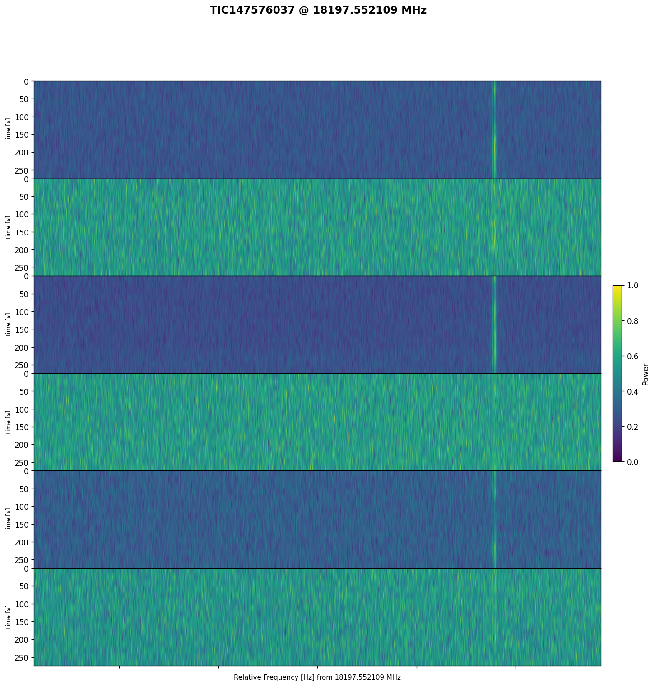
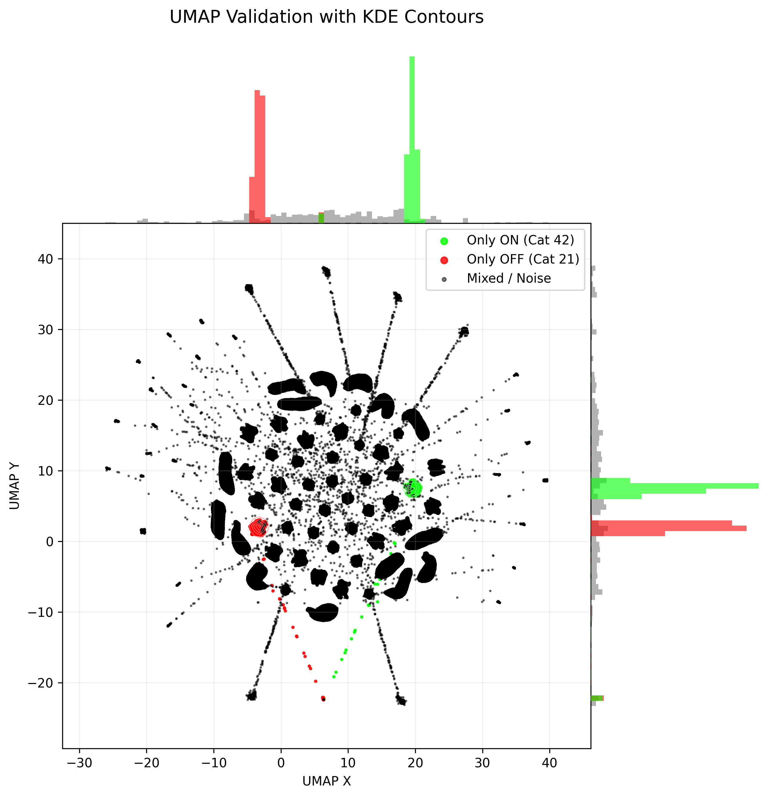
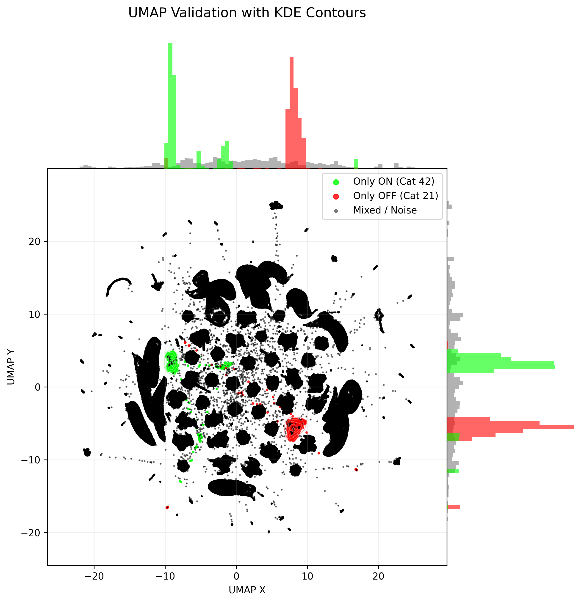
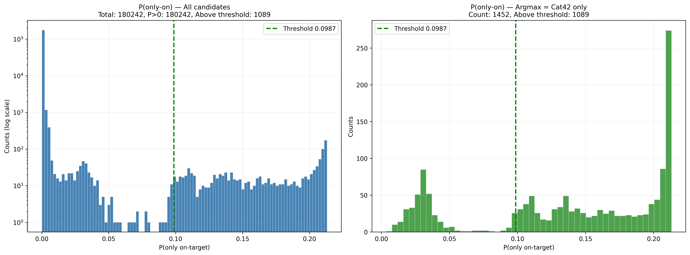
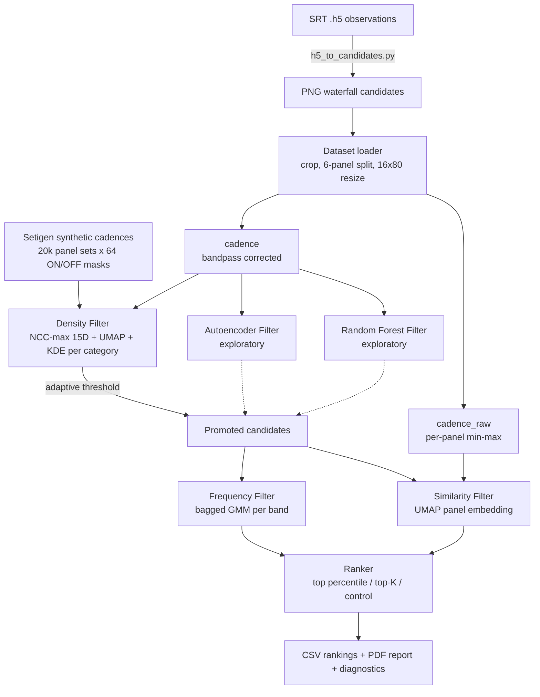
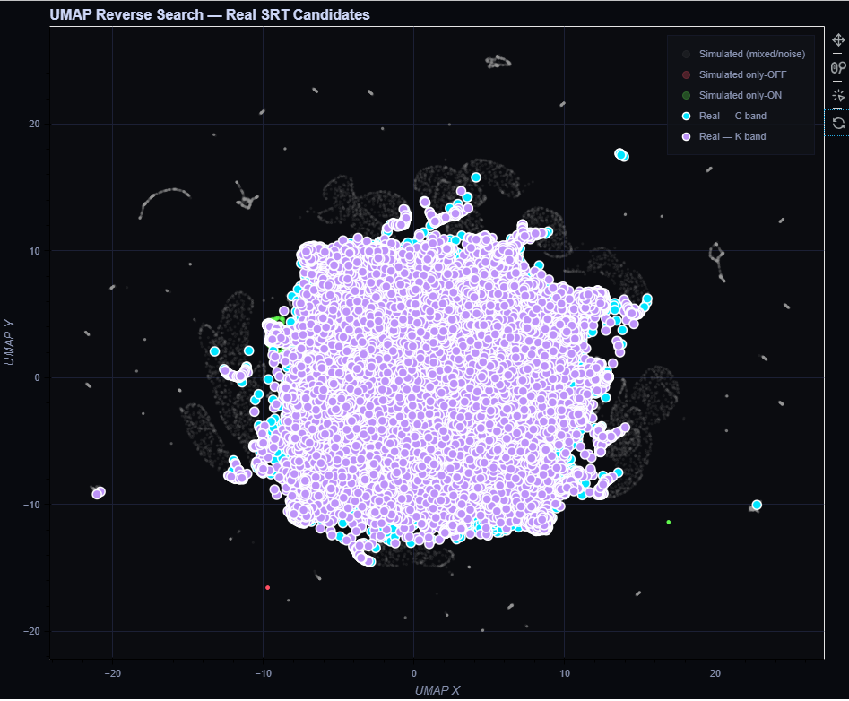

# SRT Anomaly Detection


Modular anomaly-detection pipeline for SETI technosignature candidates observed with the
**Sardinia Radio Telescope (SRT)**.

The pipeline screens large volumes of ON/OFF observation cadences and ranks the small subset
worth human inspection. It reproduces end-to-end the methodology of **Pardo et al. (2025)** —
developed within Breakthrough Listen and calibrated on Green Bank Telescope data — rebuilt from
the published description alone, with no inherited code, and adapted to SRT observations in
**C band (4.2–7.7 GHz)** and **K band (18–26.5 GHz)**.

---

## Context

Software product of a bachelor's thesis in *Informatica Applicata e Data Analytics* at the
**Università degli Studi di Cagliari**, developed during a curricular internship at
**INAF – Osservatorio Astronomico di Cagliari** and defended on 24 July 2026.

> **[Adattamento e validazione di una pipeline di rilevamento di anomalie per dati
> radioastronomici SETI del Sardinia Radio Telescope](docs/Tesi_Davide_Deplano.pdf)**

The scientific question is transferability. A pipeline calibrated on one instrument and one set
of observing bands is not automatically applicable to another: SRT operates in higher bands than
those used by Pardo et al., and is not currently part of a systematic SETI observing programme.
Verifying whether the methodology transfers, identifying where it breaks and proposing targeted
architectural changes is the contribution — beyond the single instrument, it is a step towards a
shared methodology for multi-instrument SETI.

---

## Results on real SRT data

Full production run over the candidates extracted from SRT C- and K-band observations.

| Stage | Input | Output | Notes |
| --- | --- | --- | --- |
| Candidate extraction | SRT `.h5` observations | **180,242** windows | 4096-channel windows (≈ 11.4 kHz) |
| Density Filter | 180,242 | **1,089** (0.60%) | 1,452 with argmax on the only-on category; adaptive threshold *P\** = 0.0987 |
| Frequency Filter | 1,089 | scored | GMM ensemble, `n_components = 10` per band |
| Similarity Filter | 1,089 | scored | 1 candidate at *S*<sub>sim</sub> = 1.00, 4 above 0.5, 21 above 0.1 |
| Ranking | 1,089 | **842** in the combined top-K | 273 C band, 569 K band |

The highest-ranked candidate is **TIC 147576037 at 18197.55 MHz** (K band), top of the Similarity
Filter with *S*<sub>sim</sub> = 1.00, recurring across three adjacent windows of the same target.
Visual inspection confirms a narrowband signal coherent across the three ON panels and absent
from the OFF panels.



*Cadence of TIC 147576037 at 18197.55 MHz (K band), top of the Similarity Filter with S_sim = 1.00. The narrowband signal is coherent across the three ON panels and absent from the OFF panels.*

**The pipeline is a screening tool, not a classifier.** No ground truth exists for SRT candidates:
the output is a prioritised list for human inspection, not a detection claim.

---

## What differs from Pardo et al. (2025)

Three architectural limits of the original pipeline were identified and addressed.

### 1. NCC-max feature extractor

The reference work describes the 15 pairwise panel features as *cross-correlation*, but the
implementation computes the zero-lag Pearson coefficient — the single lag-zero case. A signal
that drifts in frequency between observations, the expected behaviour of a real celestial source,
no longer overlaps positionally across ON panels and the correlation collapses regardless of its
intensity.

NCC-max takes instead the maximum of the normalised cross-correlation over a restricted lag
window: ±10% of the frequency axis (±8 columns out of 80), zero lag in time. At zero shift it
coincides exactly with the Pearson coefficient, so it is a generalisation of the original feature,
not a different measure. The feature vector keeps its 15 dimensions and the rest of the pipeline
is unchanged.

**Controlled injection test.** A narrowband signal was injected into the ON observations only of a
clean real cadence (TIC 371234684, C band) at six SNR levels and two window widths. Candidates
counted are those whose argmax falls on the only-on category.

| Model | Fixed-position injection | Drifting injection (0.5 Hz/s) | Real candidates |
| --- | --- | --- | --- |
| Pearson | 12/12 | 0/12 | 1/18 |
| NCC-max | 11/12 | 3/12 | 1/18 |

Both models recover fixed-position injections; only NCC-max recovers drifting ones. Drift
tolerance depends on window width: roughly 0.9 Hz/s at 4096 channels, 0.3 Hz/s at 640.

|  |  |
| --- | --- |
| Pearson (zero-lag) features | NCC-max features |

*UMAP validation embedding with KDE contours, before and after replacing the feature extractor. Green marks the only-on category (42), red the only-off category (21).*

### 2. Adaptive threshold for the Density Filter

The original promotion threshold is a fixed value (0.0618) calibrated on the probability
distribution observed on GBT data, and does not transfer to an instrument with different
statistics. Here the threshold is recomputed at every run: the histogram of *P*(only-on) is
smoothed and the first local minimum after the main peak is taken as the cut, falling back to the
25th percentile when the distribution shows no clear valley. On the SRT production run this
yielded *P\** = 0.0987 (the fallback was not triggered).



*Distribution of P(only-on) over the 180,242 real candidates. Left: all candidates, log scale. Right: the 1,452 with argmax on the only-on category, showing the two modes separated by the valley at 0.0987 that the adaptive logic detects.*

### 3. `cadence_raw` representation for the Similarity Filter

The standard preprocessing includes a bandpass correction that divides each channel by its own
time average, suppressing components that stay constant in frequency along the observation —
precisely the morphology of a persistent narrowband signal, which is what this filter must
recognise. The Similarity Filter therefore scores a dedicated representation: per-panel min-max
normalisation in [0, 1], no bandpass correction.

### Two further empirical findings

**UMAP metric.** A systematic grid search over `n_neighbors`, `min_dist` and metric, evaluated on
centroid distance, silhouette and mean KDE probability of the only-on category, was run twice —
once on the Pearson features and once after introducing NCC-max. In both iterations every
configuration in the top ten uses the **`correlation`** metric, not the `canberra` metric adopted
in the reference work. With NCC-max features the gap becomes an order of magnitude in centroid
distance, with silhouette around 0.79 against below 0.30 for `cosine` and near zero for
`canberra`.

| Rank | n_neighbors | min_dist | metric | centroid | silhouette | p_ON_mean |
| --- | --- | --- | --- | --- | --- | --- |
| 1 | 25 | 0.1 | correlation | 5.081 | 0.788 | 0.2857 |
| 2 | 100 | 0.1 | correlation | 4.295 | 0.799 | 0.3779 |
| 3 | 25 | 0.01 | correlation | 3.259 | 0.752 | 0.3652 |
| 5 | 25 | 0.1 | cosine | 0.820 | 0.295 | 0.3084 |
| 9 | 25 | 0.1 | canberra | 0.279 | 0.054 | 0.2623 |

Rank 1 was selected for the final model: highest centroid distance of the search, and visual
inspection of the embeddings confirms the cleanest separation between the reference categories
and the central cloud.

**GMM component count.** `n_components = 100` is overfit for the candidate volumes SRT produces.
Ranking stability between adjacent grid values — Spearman correlation over the full ranking plus
top-20 overlap — collapses between 20 and 50 in both bands. The largest stable value,
`n_components = 10`, was selected.

---

## Pipeline architecture



### Stage details

**Dataset loader** (`core/dataset.py`) — reads PNG waterfall plots recursively, converts to
grayscale, crops the plot area, splits it into the 6 ON/OFF panels (white-separator detection with
uniform-split fallback) and resizes each panel to 16×80. Two representations are built: `cadence`
(time normalisation, DC-spike removal, B-spline bandpass correction) and `cadence_raw` (per-panel
min-max, no bandpass). Frequencies inside the 1.20–1.33 GHz and 2.30–2.36 GHz notches are
discarded.

**Simulation** (`simulation/generator.py`) — Setigen-based generation: `n_panel_sets` background
realisations, each expanded over all 64 binary ON/OFF masks. The synthetic cadences are
deliberately schematic and are *not* meant to reproduce the morphology of real waterfalls: the 64
categories are defined by the position of the signal across the six slots, not by its shape, and
it is the regions they occupy in feature space that constitute the decision criterion. Imposing a
realistic signal morphology would mean assuming a priori what an extraterrestrial signal looks
like, contradicting the premise that its form is unknown. Background noise is drawn from real SRT
`.h5` files across multiple observing sessions on distinct days, so that the simulated dataset
samples the real variability of instrumental noise.

**Density Filter** (`ml/filters/density.py`) — 15D NCC-max features → UMAP (2D,
`n_neighbors=25`, `min_dist=0.1`, metric `correlation`) → one KDE per category (exponential
kernel, bandwidth 0.30). A candidate is scored with the KDE probability only when the argmax
category is the only-on pattern (category 42); otherwise the score is 0.

**Frequency Filter** (`ml/filters/frequency.py`) — bagged Gaussian Mixture Models fitted per band
on the candidate frequency distribution; raw score is `1 / mean_pdf` (rarer frequency → higher
score), min-max scaled to [0, 1]. `n_components` and `bag_size` adapt automatically when few
candidates are available. The top 5% most populated frequency bins are cut only when at least 200
candidates survive the density stage. The discriminative margin differs sharply between bands: C
band shows a bimodal frequency occupation with clear gaps, K band an almost flat one.

**Similarity Filter** (`ml/filters/similarity.py`) — each panel is block-averaged from 16×80 to
8×16, flattened and embedded with UMAP; the score is the ON/OFF separation ratio

```
score = (1 + Σ_{on,off} d²) / (1 + Σ_{on,on} d²)
```

with squared Euclidean distances in the embedding plane, min-max scaled to [0, 1]. The symmetric
regularisation keeps the score finite when the ON panels collapse to a single point.

**Ranker** (`management/ranker.py`) — builds four samples: top percentile by frequency score per
(target, band), top percentile by similarity score, top-K by the geometric mean of both scores,
and a random control set.

---

## Exploratory branches

Two alternative first-stage filters were built and evaluated against the Density Filter on the
same 180,242 candidates. Both are documented negative results: they delimit the validity domain of
their respective approaches and are **not** substitutes for the reference workflow.

### Autoencoder Filter

A convolutional autoencoder trained on the simulated cadences *excluding* the only-on category, so
that it learns to reconstruct every statistically frequent pattern but not the anomalous one of
interest. Architecture searched with Keras Tuner (Hyperband); the selected configuration is
`n_conv_layers=2`, `filters_1=32`, `filters_2=64`, `latent_dim=128`, `learning_rate=1e-3`. Score
is the reconstruction MSE normalised between the 1st and 99th percentile of the error distribution
on the real candidates (MSE<sub>min</sub> = 0.0044, MSE<sub>max</sub> = 0.0271). Training streams
memory-mapped `.npy` batches so that arrays larger than GPU VRAM never enter memory at once.

At threshold 0.99 the filter promotes **2,267** candidates (1.26%), a volume comparable to the
Density Filter's 1,089 — the condition for a balanced comparison. The two pools turn out to be
almost disjoint: **10 candidates in common**, under 1% in both directions, for a union of 3,346.
The comparison is unambiguous about which of the two is right:

- the Density workflow surfaces TIC 147576037, visually confirmed as only-on;
- the Autoencoder workflow places it nowhere near the top of any ranking, and puts
  TIC 154872375 at 6708.31 MHz first with *S*<sub>sim</sub> = 1.00 — a cadence which on visual
  inspection contains no coherent narrowband signal at all and is compatible with background noise;
- the two combined top-K samples share only 4 candidates, none of which shows an only-on signal.

An internal check across all 64 synthetic patterns explains why. The ratio between the mean
reconstruction error of the only-on category and that of the others is 1.38, but the aggregate
hides the structure: on categories with few active panels the model reconstructs very well and
only-on stands out by two orders of magnitude, while on categories with many active panels it is
comparable or lower. The model discriminates on the **total amount of signal** in the cadence, not
on its distribution between ON and OFF panels — and it fails to do so even on the domain it was
trained on. The cause is the objective function: a global MSE aggregates error uniformly over
every pixel and is dominated by background noise, while the narrowband signal occupies a
negligible fraction of the cadence. Excluding only-on from training, reasonable as a premise, is
not sufficient to make the model sensitive to it as a structurally distinct category.

### Random Forest Filter

A supervised binary classifier on 20 handcrafted scalar features encoding ON/OFF contrast at
different aggregation levels — peak, robust peak (p99), mean, standard deviation, column-wise max,
hot-pixel fraction, row-wise energy. Positives are only-on cadences, negatives the other 63
patterns, balanced. Hyperparameters are selected by grid search over `n_estimators × max_depth`
with 5-fold stratified CV on ROC-AUC; the score is the positive-class probability.

Alignment of preprocessing is critical and is handled explicitly: the synthetic cadences are run
through the same `_preprocess_spectrogram` applied to real candidates. Without it the classifier
sees synthetic values in raw scale (~1e6) while real candidates arrive normalised around 1.0, a
catastrophic domain shift.

The features reach ROC-AUC ≈ 0.96 on synthetic only-on versus non-only-on discrimination, but the
model does not transfer: on real SRT candidates the score distribution over the Density-promoted
subset is essentially indistinguishable from that of the rest of the dataset. Together with the
autoencoder result, this identifies the **gap between synthetic and real domain** as the open
problem for any supervised or reconstruction-based extension of the pipeline.

---

## Repository structure

```
config/
  default.yaml                       Global configuration (paths, hyperparameters)
docs/
  paper/                             Reference paper (Pardo et al. 2025)
  uml/                               Use case, activity, sequence, class diagrams
  *.docx                             Theory notes: UMAP, KDE, GMM, B-spline interpolation
scripts/
  h5_to_candidates.py                SRT .h5 -> PNG candidate windows
  noise_extractor.py                 Real background noise patch for the simulator
  injection_test.py                  Controlled signal injection (positive control)
  umap_grid_search.py                UMAP hyperparameter grid search
  umap_reverse_search.py             Interactive candidate projection (Bokeh HTML)
  calibrate_frequency_ncomp.py       GMM n_components stability analysis
  generate_png_by_frequency.py       Render a specific frequency across all cadences
  category.py                        PDF diagnostic report by category
  unix/, win/                        Environment setup and run scripts
src/srtad/
  core/candidate.py                  Candidate entity (metadata, cadences, scores)
  core/dataset.py                    PNG and synthetic cadence loading, preprocessing
  management/cross_correlation_extractor.py           NCC-max 15D feature extractor
  management/cross_correlation_extractor_pearson.py   Pearson baseline (comparison)
  management/ranker.py               Ranking and sampling logic
  management/visualizer.py           Plots, diagnostics, adaptive threshold
  ml/filters/i_filter.py             Filter interface (fit / calculate / load / save)
  ml/filters/density.py              Density Filter (UMAP + KDE)
  ml/filters/frequency.py            Frequency Filter (bagged GMM)
  ml/filters/similarity.py           Similarity Filter (UMAP panel embedding)
  ml/filters/autoencoder.py          Autoencoder Filter (exploratory)
  ml/filters/rf_filter.py            Random Forest Filter (exploratory)
  ml/models/ae_hypermodel.py         Keras Tuner hypermodel
  ml/models/rf_features.py           20 handcrafted ON/OFF contrast features
  simulation/generator.py            Setigen synthetic cadence generator
  utils/logger.py                    Logging setup
  config.py                          YAML configuration loader
  main.py                            Interactive CLI entry point
env.yml                              Conda environment specification
```

Runtime directories `data/`, `models/`, `results/` and `logs/` are created by the pipeline and are
not versioned.

---

## Installation

The project uses **Conda**. Python 3.11, TensorFlow/Keras, UMAP, scikit-learn, Setigen and blimpy
come from `env.yml`.

```bash
bash scripts/unix/setup_env.sh      # Linux / macOS
```

```bat
scripts\win\setup_env.bat           REM Windows
```

The script creates or updates the `srt-anom` environment. `blimpy` is required by the `.h5`
ingestion scripts and may need a separate `pip install blimpy` depending on the platform.

---

## Usage

Run from the **project root** — the configuration loader resolves `config/default.yaml`
relatively, and the package imports assume the root is on `PYTHONPATH`.

```bash
scripts/unix/run.sh          # Linux / macOS
scripts\win\run.bat          # Windows
```

The run scripts activate the environment themselves. The entry point is an interactive menu:

| Option | Action |
| --- | --- |
| 1 | Generate synthetic cadences |
| 2 | Train the density model on simulated data |
| 3 | Run the Density Filter on real candidates |
| 4 | Run the Frequency + Similarity Filters |
| 5 | Run the ranking |
| 6 | UMAP reverse search (interactive HTML) |
| 7 | Train the Autoencoder on simulated data |
| 8 | Run the Autoencoder Filter |
| 9 | Train the Random Forest Filter on simulated data |
| 10 | Run the Random Forest Filter |

| Workflow | Sequence |
| --- | --- |
| Reference (Density Filter) | `1 → 2 → 3 → 4 → 5` |
| Autoencoder branch | `1 → 7 → 8 → 4 → 5` |
| Random Forest branch | `1 → 9 → 10 → 4 → 5` |

Training steps are idempotent: if the models already exist on disk they are loaded instead of
retrained. The first-stage steps save `results/passed_candidates.pkl`, so steps 4 and 5 can be
re-run in a new session without repeating the selection stage.

### Preparing the input data

The pipeline consumes **PNG waterfall plots**, one per candidate, each containing the 6 stacked
panels of an ON/OFF cadence, read recursively from `paths.real_png_dir`.

```bash
python scripts/h5_to_candidates.py --scan /path/to/h5_dir --dry-run
python scripts/h5_to_candidates.py --scan /path/to/h5_dir
```

The script groups `.h5` files into valid 6-observation cadences by target name, observing date and
ON/OFF pattern, discards incomplete or non-conforming ones, slides a 4096-channel window along the
frequency axis and writes one PNG per window, interleaving C and K band for balanced output. Each
panel is log-scaled and min-max normalised; when the frequency axis of the file decreases, the
window is mirrored so that frequency always increases left to right.

Recognised filename patterns:

| Pattern | Example | Metadata extracted |
| --- | --- | --- |
| `candidate_<n>_<freq>MHz.png` | `candidate_00042_6500.123456MHz.png` | central frequency |
| `..._dr_<drift>_freq_<freq>...` | `TIC12345_dr_0.10_freq_6500.12.png` | frequency, drift rate |
| `..._<freq>MHz...` | `TIC12345_18000.5MHz.png` | central frequency |

The target identifier is taken from a `TIC<digits>` token in the filename, otherwise from a
`TIC<digits>` ancestor directory, otherwise from the parent folder name. Files matching none of
the patterns are listed in `results/skipped_files.txt`.

---

## Configuration

All tunable parameters live in `config/default.yaml`. The values below are those of the production
run.

| Key | Value | Meaning |
| --- | --- | --- |
| `paths.real_png_dir` | *absolute path* | **Must be edited before the first run** |
| `random_seed` | 42 | Global seed for every stochastic component |
| `simulation.n_panel_sets` | 20000 | Background realisations (× 64 masks = 1.28M cadences) |
| `simulation.fchans` / `tchans` | 80 / 16 | Synthetic frame size |
| `simulation.df_hz` / `dt_s` | 2.794 / 18.254 | Spectral and temporal resolution |
| `simulation.amplitude_factor` | [4.0, 10.0] | Injected signal amplitude range |
| `simulation.drift_rate_hz_s` | [-4.0, 4.0] | Injected drift range |
| `filters.density.umap_metric` | `correlation` | Metric selected by grid search |
| `filters.density.n_neighbors` / `min_dist` | 25 / 0.1 | UMAP hyperparameters |
| `filters.density.kde_bandwidth` / `kernel` | 0.30 / `exponential` | Per-category KDE |
| `filters.density.only_on_category` | 42 | ON-OFF-ON-OFF-ON-OFF pattern ID |
| `filters.frequency.n_components_C` / `_K` | 10 / 10 | GMM components per band |
| `filters.frequency.n_bags` / `bag_size` | 10 / 5000 | Bagging configuration |
| `filters.similarity.umap_metric` | `euclidean` | Panel embedding metric |
| `ranker.top_k` / `control_k` | 1000 / 3000 | Ranking and control sample sizes |

The amplitude range deserves a note. The factor multiplies the local noise peak, so `α < 1`
produces cadences where the injected signal sits below the local noise peak while still being
labelled as signal present — label noise that risks teaching the model to associate the signal
label with structures of the background alone. The original [0.0, 4.0] range is calibrated on a
GBT S-band cadence; after consultation with the Berkeley SETI Research Center it was reformulated
as [4.0, 10.0]. This is an explicit restriction of the validity domain: signals with amplitude
close to the noise peak fall outside the learned distribution and are not guaranteed detectable.

The density threshold is **not** a configuration value in production: it is recomputed adaptively
at every run and printed as `[DENSITY] Adaptive threshold: ...`. The Random Forest promotion
threshold defaults to 0.5 and can be overridden under `filters.rf_filter.threshold`.

---

## Outputs

Everything is written under `results/`.

| File | Content |
| --- | --- |
| `passed_density.csv` | Candidates above the adaptive density threshold |
| `passed_autoencoder.csv` | All candidates with their autoencoder score |
| `passed_rf.csv` | All candidates with their Random Forest score |
| `top_k_combined.csv` | Final ranking by geometric mean of frequency and similarity scores |
| `top_freq_percentile.csv` | Top percentile by frequency score, per (target, band) |
| `top_sim_percentile.csv` | Top percentile by similarity score, per (target, band) |
| `random_control.csv` | Random control sample for statistical comparison |
| `REPORT_CATEGORIES.pdf` | Visual report of candidates grouped by category |
| `density_real_hist.png` | *P*(only-on) distribution with the adaptive threshold |
| `umap_paper_figure.png` | UMAP validation embedding with KDE contours |
| `frequency_hist.png`, `freqscore_hist.png` | Frequency and frequency-score distributions per band |
| `similarity_umap.png` | Panel embedding with scored candidates highlighted |
| `passed_candidates.pkl` | Serialised state, reused by steps 4–5 |
| `skipped_files.txt` | Files rejected for unrecognised filename format |

---

## Auxiliary analyses

| Script | Purpose |
| --- | --- |
| `umap_grid_search.py` | Grid search over `n_neighbors`, `min_dist` and metric, with cached CC features and stratified subsampling |
| `calibrate_frequency_ncomp.py` | Selects the GMM component count via Spearman ranking stability and top-K overlap between adjacent grid values |
| `injection_test.py` | Injects a drifting narrowband signal into the ON observations of a real cadence at several SNR levels; the lowest passing amplitude is the empirical sensitivity |
| `umap_reverse_search.py` | Projects real candidates into the trained UMAP space and produces an interactive Bokeh page for cluster and RFI investigation, with proximity search around a selected candidate |
| `noise_extractor.py` | Extracts real background noise patches from `.h5` files for the simulator |
| `generate_png_by_frequency.py` | Renders a specific frequency across all available cadences |

**UMAP Reverse Search** deserves a mention beyond the table. It was born from a practical
deadlock: the statistical models produced numerically plausible results, but there was no
immediate way to check whether the promoted candidates actually fell in the expected region of the
latent space. It reuses the UMAP model trained on simulated data and projects the real candidates
into the same plane with no retraining, overlaying the simulated training set coloured by category
and the real candidates coloured by band. Selecting a point shows its metadata and source path.



*Real SRT candidates (C band in cyan, K band in violet) projected into the UMAP space of the trained model, overlaid on the simulated training set coloured by category.*

---

## Computational notes

The production run was executed on a machine with two NVIDIA RTX 4090 (24 GB each) and NVMe
storage.

- Synthetic generation produces `n_panel_sets × 64` tensors: 1.28M files at the production
  setting, with a correspondingly large disk footprint.
- CC feature extraction, PNG loading and candidate scoring are parallelised with `joblib` across
  all available cores.
- Autoencoder training never loads the full array into memory: `X_train` and `X_val` are written
  as `.npy` and streamed through memory-mapped `tf.data` generators.
- Only the autoencoder branch requires a GPU. The reference workflow (options 1–5) is CPU-bound.

---

## Limitations

- The injection test is a positive control on a single cadence at a single drift rate, not a
  statistical characterisation of sensitivity.
- Training rests entirely on synthetic cadences, which do not reproduce the morphological variety
  of real astrophysical signals or of site-specific RFI. The Random Forest experiment shows this
  gap has concrete effects: high accuracy on the synthetic domain, indistinguishable score
  distributions on the real one.
- Transferability was verified on one instrument. One case shows adaptation is possible; it does
  not establish transferability as a general property of the methodology.
- Target metadata is unavailable for the current SRT dataset, so the `(target, band)`
  stratification in the ranker collapses to band only.
- Automatic selection reduces the search space; it does not decide on the authenticity of a
  signal. Final inspection remains human, and scales only so far as data volumes grow.

---

## Reference

Pardo et al. (2025), *Using Anomaly Detection to Search for Technosignatures in Breakthrough
Listen Observations*, The Astronomical Journal, 170:12 (9pp). DOI:
[10.3847/1538-3881/add52b](https://doi.org/10.3847/1538-3881/add52b). Open Access; a copy is
included in [`docs/paper/`](docs/paper/).

---

## License

MIT — see [LICENSE](LICENSE).
